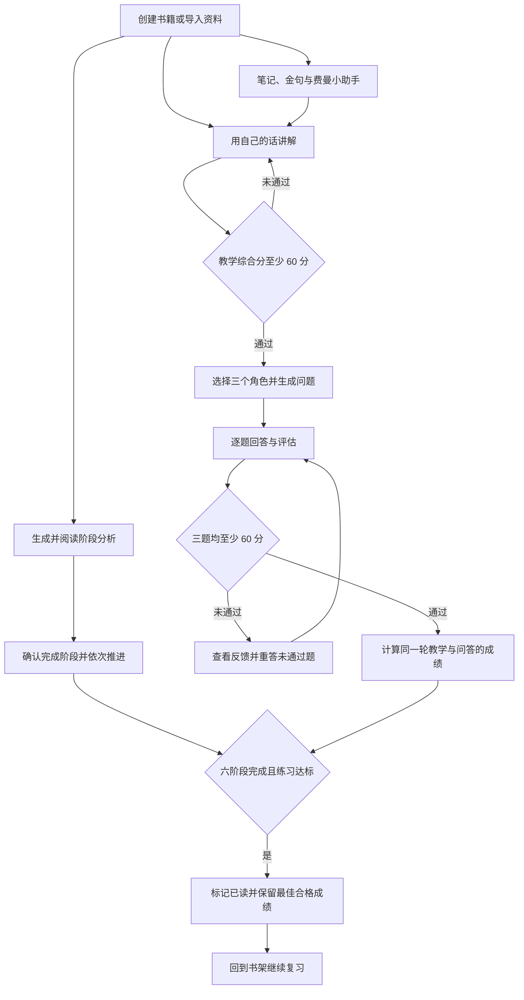
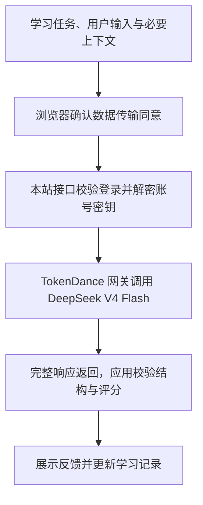

# 费曼读书助手 · Feynman Reader

<a id="top"></a>

<p align="center"></p>


[](LICENSE)
[](https://github.com/HachikoJ/Feynman-Reader)

[打开费曼读书助手](https://reader.deline.top/) · [English](README.en.md) · [核心体验](#核心体验) · [产品预览](#产品预览) · [AI 怎么工作](#ai-怎么工作) · [如何运行](#如何运行) · [反馈问题](https://github.com/HachikoJ/Feynman-Reader/issues)

**读完不算懂，能讲清楚才算。**

费曼读书助手是基于费曼学习法的 AI 阅读工作台。围绕一本书建立六阶段阅读框架，用自己的话讲解，再通过评分和三个角色的追问发现理解漏洞。笔记、金句和费曼小助手把一次练习连接到后续阅读与复习。

产品地址：**[https://reader.deline.top/](https://reader.deline.top/)**。当前版本：[v0.4.2](https://github.com/HachikoJ/Feynman-Reader/releases/tag/v0.4.2)；[更新记录](CHANGELOG.md) · [版本发布与恢复](docs/operations/releases-and-rollback.md)。每次上线的源码都在 GitHub 上留有 `deploy-` 快照标签，例如 [deploy-v0.4.0-a3b2ab0](https://github.com/HachikoJ/Feynman-Reader/releases/tag/deploy-v0.4.0-a3b2ab0)。


> 截图来自实际应用界面，使用虚构普通账号、模拟书架、对话和评分；部分阶段内容来自公开系统示例。不包含真实用户数据，也不代表模型效果测评。账号中心已更新为 v0.2.2，其余界面沿用 v0.2.1 截图，详见[截图来源](docs/product/screenshots/v0.2.1/README.md)与[本次更新](docs/product/screenshots/v0.2.2/README.md)。

## 核心体验

| 环节 | 当前版本的体验 |
| --- | --- |
| 书架与资料 | 创建书籍、编辑封面、管理标签与书单，或导入 EPUB、MOBI / AZW3、FB2、PDF、DOCX / DOC、HTML、RTF、TXT、Markdown、JSON 等格式；EPUB / MOBI 会自动带出书名、作者、封面与章节。 |
| 原文阅读 | 在站内按章节阅读原文，调整字号与主题；选中原文可划四种颜色的线、写笔记、打标签（单个标签 24 字以内、每条划线最多 8 个，输入时有全书已有标签提示），点击已有划线能改色、补备注、增删标签或删除。工具栏支持书签（本节已标记时打开书签列表，可补备注改色）、全书关键词检索、目录与划线／书签面板，以及键盘左右方向键翻节；划线面板可按章节和标签筛选。划线保留章节出处与字符位置，可作为费曼复述与 AI 分析的核对依据；「我的笔记」里同时聚合划线与书签，并可按来源（原文划线／外部导入／手工笔记）和标签筛选。 |
| 外部笔记导入 | 支持 Readwise、Zotero 官方 API，以及微信读书、Kindle、Apple Books 等平台的官方导出笔记导入；「平台支持说明」里列出各平台的导出步骤与官方链接，不采用任何 cookie 抓取或逆向方案。 |
| 六阶段学习 | 按背景探索、全书概览、深度拆解、辩证分析、众声回响、融会贯通建立理解；确认完成当前阶段后解锁下一阶段。 |
| 教学模拟 | 输入 200–20,000 字的个人讲解，查看准确度、完整度、清晰度与综合评分，以及原文和改进建议。 |
| 三角色问答 | 教学通过后，使用默认组合、预设组合或自行选择三个角色；逐题回答、评估和重答。 |
| 笔记与复习 | 保存笔记、金句和学习历史；书架依据薄弱点、未完成任务及活动记录给出复习建议。 |
| 费曼小助手 | 多会话问答、关联书籍、参考附件、编辑重发、分支会话、复制和 Word 导出；选中文本可收藏为金句。 |
| 账号中心 | 统一管理个人资料、书架、金句与助手会话，查看学习统计和活动日历，管理长期记忆、回收站及记录导入导出。 |

可先浏览《追风筝的人》系统示例，体验完整学习流程；通过 **【观猹】登录**后，开始自己的阅读与练习。使用 AI 前，在设置中连接 TokenDance，并确认相关的数据使用说明。

## 产品预览

### 六阶段阅读


阅读原文、阶段学习、费曼实践、我的笔记、相关推荐是同一本书的五个视图。分析结果可以折叠阅读，生成分析不会自动替你确认阶段完成。

### 教学模拟与问答记录


<details>
<summary>查看教学输入与三个角色的完整问答</summary>


</details>

### 费曼小助手

<p></p>

小助手结合当前账号的相关学习资料继续讨论。你可以切换会话、引用书籍或上传参考资料；明确提出“记住”等请求时，可以保存学习偏好，并在账号中心管理记忆开关、删除或导出记忆。

<details>
<summary>手机端：书架、费曼小助手与账号中心</summary>

<p>
  
  
  
</p>

</details>

### 账号中心与暗色模式


<details>
<summary>查看暗色书架与随主题切换的 TokenDance 标志</summary>


</details>

## 核心交互流程



教学和问答必须属于**同一学习轮次**。合格轮次的综合成绩为“教学综合分”与“三题平均分”的平均值；每题都需通过，不能用其他题的高分抵消。书籍还需完成六阶段，才会标记为已读。练习、笔记和助手可以在阅读过程中使用，不必等到所有分析结束。

## AI 怎么工作



当前线上通过 TokenDance 调用 `deepseek-v4-flash-0731`。浏览器访问本站 `/api/ai/chat/completions/`，服务端读取并解密当前账号的 API Key 后转发请求。当前接口返回完整响应，不提供逐字流式输出；官方 DeepSeek 直连保留为部署可选渠道，线上默认关闭。

| 部分 | 输入与边界 |
| --- | --- |
| 阶段分析 | 书名、作者、阶段提示及可用的文档参考片段。文档按长度选取上下文，不保证每次发送整本原文。 |
| 教学评估与问答 | 用户讲解、选择的角色、当前轮次的问题与回答。模型提供评分建议，程序校验有效分数、轮次关系和完成条件。 |
| 费曼小助手 | 当前账号的相关书籍、学习记录、金句、历史会话及启用的偏好记忆；没有明确书籍匹配时，可使用近期书籍摘要。上下文有长度限制。 |
| 参考附件与记忆 | 小助手最多附加 5 份资料，单份最多 12,000 字符、合计最多 30,000 字符。长期偏好需明确请求并保存成功，用户可管理与关闭。 |

小助手不具备联网搜索、代码执行或自主操作工具。AI 分析、评分和建议是学习辅助，不保证事实正确；重要结论请结合原书核验。你的解释与判断仍是学习的主体。

## 如何运行

环境：Node.js 20.9 以上、npm；生产使用 Node.js 22。

```bash
npm ci
npm run dev
```

打开 [http://localhost:8080](http://localhost:8080) 浏览系统示例。完整账号读写需要 PostgreSQL、OAuth 与服务端密钥配置，字段见 [.env.example](.env.example)。不要把真实密钥提交到 Git。

### 本地预览

当前正式 OAuth 回调是 `https://reader.deline.top/api/auth/tokendance/callback`，不能直接用于 localhost 授权。在观猹渠道关闭时，可在 `.env.local` 设置 `NEXT_PUBLIC_FEYNMAN_LOCAL_AUTH_BYPASS=true` 启用本地浏览器存储模式，并在未登录时展示模拟账号中心；模拟账号操作不写入云端。

**该开关不会因生产构建自动失效。** 正式部署必须显式关闭旁路；真实 OAuth 和云端读写需使用已登记的回调与服务端配置验证。

### 生产部署

当前使用腾讯云、PostgreSQL、Next.js standalone、PM2 与 Nginx HTTPS 代理。按 [.env.example](.env.example) 配置仅服务端可读的 `/etc/feynman-reader.env`，并通过 `deploy.sh` 构建和部署。关键开关为：

```env
TOKENDANCE_OAUTH_REDIRECT_URI=https://reader.deline.top/api/auth/tokendance/callback
FEYNMAN_COOKIE_SECURE=true
FEYNMAN_WATCHA_OAUTH_ENABLED=true
FEYNMAN_TOKENDANCE_ENABLED=true
FEYNMAN_DEEPSEEK_OFFICIAL_ENABLED=false
NEXT_PUBLIC_FEYNMAN_LOCAL_AUTH_BYPASS=false
```

渠道的前端编译开关由部署流程同步，变更后需完整重建。产品域名与 TokenDance 归因标识用途不同：产品访问和 OAuth 回调使用 `reader.deline.top`，登记的 `X-App-URL` 仍为 `https://www.deline.top`。不要把归因标识随访问地址一并替换。

发布与恢复沿用固定版本标签、源码校验文件及部署记录，详见[版本发布与恢复](docs/operations/releases-and-rollback.md)。恢复应用版本与恢复数据库是不同操作，不能用旧版应用覆盖现有学习数据。

## 数据、费用与边界

- 个人书架、笔记和练习记录归属各自账号，可在账号中心查看和管理，并通过导入、导出及回收站整理自己的学习资料。
- 账号中保存的 API Key 由服务端加密，不向浏览器返回其明文，也不进入学习数据导出；调用 AI 前需确认相关内容的数据传输。
- 书籍文档支持 PDF、DOCX / DOC（Word 97-2003 二进制，内置 OLE 解析，不依赖额外依赖）、TXT、Markdown、JSON；文件最多 20 MB，PDF 最多 1,000 页，解析文本最多 100 万字符。PDF 会先抽样最多 4 页检查文字层；扫描型 PDF 会快速提示转换，不自动 OCR。当前不支持 Excel、DJVU / CHM / CBZ 等扫描或压缩包格式，以及图片 OCR。
- AI 费用取决于输入、输出及所选线路，以 [TokenDance 实时价目](https://tokendance.space/models/deepseek-v4-flash-0731)为准，不把限时活动视为固定价格承诺。
- 书架已有复习建议卡片；语音转写、OCR、固定 D1/D7/D21 复习排程和自动提醒尚未实现。主学习流程统一为顺序六阶段。

## 技术栈与项目资料

| 层 | 实现 |
| --- | --- |
| 界面 | Next.js 16、React、TypeScript、Tailwind CSS |
| AI | TokenDance 的 OpenAI 兼容网关、DeepSeek V4 Flash |
| 数据 | PostgreSQL、账号会话、服务端密钥加密 |
| 文档 | PDF.js、Mammoth 与文本解析 |
| 验证 | Jest、Playwright、TypeScript、ESLint |

- [更新记录](CHANGELOG.md)与[版本发布与恢复](docs/operations/releases-and-rollback.md)
- [参与贡献](CONTRIBUTING.md)与[安全问题反馈](SECURITY.md)
- [隐私政策](https://reader.deline.top/privacy/)
- [历史产品方案与提交材料](docs/product/submission/README.md)：保留早期设计背景；当前功能以本 README 和版本记录为准。

常用开发检查：

```bash
npx tsc --noEmit
npm run lint
npm test -- --runInBand
npm run build
git diff --check
```

## 维护与贡献

项目维护：[HachikoJ](https://github.com/HachikoJ)。当前 AI 开发协作：**OpenAI Codex**，参与实现、问题排查、测试及文档维护。欢迎通过 [Issues](https://github.com/HachikoJ/Feynman-Reader/issues) 和 Pull Request 提交反馈与改进。

GitHub 自动生成的 [Contributors](https://github.com/HachikoJ/Feynman-Reader/graphs/contributors)依据提交历史与共同作者署名统计，可能包含历史协作记录，不等同于当前维护团队。

## 开源授权

本项目使用 [MIT License](LICENSE)。使用、修改或分发时，请保留原始版权和许可声明。

## 联系与交流

- GitHub：[HachikoJ](https://github.com/HachikoJ)
- 微信：`hostrow`，请备注 `费曼读书`
- 邮箱：`946106011@qq.com`

<table>
  <tr>
    <td align="center"><strong>微信联系</strong><br></td>
    <td align="center"><strong>微信赞赏</strong><br></td>
    <td align="center"><strong>支付宝赞赏</strong><br></td>
  </tr>
</table>

扫码加入微信交流群，交流使用经验与反馈问题：

<p align="center"></p>

## GitHub 关注度

[](https://star-history.com/#HachikoJ/Feynman-Reader&Date)

[返回顶部](#top)


_Forked to kylin-feng at 2026-09-13 via proxy 127.0.0.1:7897 (Clash Verge)._
